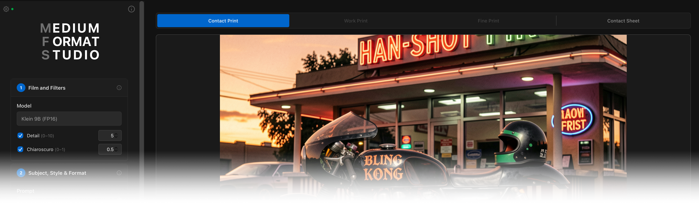
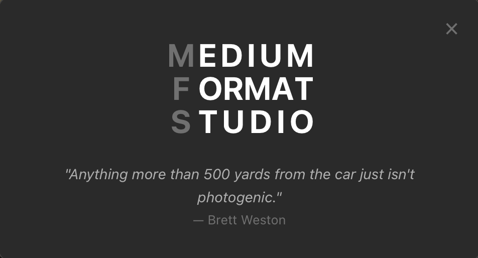

<p align="center">
  
</p>

# Medium Format Studio (MFS)

A web-based UI for AI image generation using the **Medium Format Studio** (MFS) workflow — a multi-stage darkroom-metaphor pipeline built on Flux.2 Klein 9B.

## Features

- **5-stage darkroom pipeline**: Contact Print → Work Print → Final Print, with ComfyUI execution caching so each promotion only runs the new stages
- **Progressive generation**: Evaluate a quick 6-step contact print before committing to full upscaling
- **LoRA controls**: Two LoRA slots (Detail Slider, Chiaroscuro) with per-LoRA toggle and strength
- **Film format presets**: 6x7, 6x6, 645, 6x9, 6x17, Cinemascope, Cinemascope2K
- **Model discovery**: Automatically detects available Klein 9B variants (FP16, FP8, GGUF) from the connected ComfyUI server
- **Contact Sheet gallery**: Browse recent generations with metadata, fullscreen viewer, and "Send to Contact Print" to reload params
- **Configurable server URL**: Connect to local or remote ComfyUI (RunPod, etc.) via the server settings panel
- **Real-time progress**: WebSocket-based stage-aware progress display

## Prerequisites

- **Node.js 18+** (project developed on v25; see `.nvmrc`)
- **ComfyUI** running with `--enable-cors-header`
- All required models and custom nodes installed (see [DEPENDENCIES.md](./DEPENDENCIES.md))

## Installation

```bash
git clone https://github.com/geoffsmithBK/medium-format-studio.git
cd medium-format-studio
npm install
```

## Running the Application

Two terminal windows are required:

**Terminal 1 — ComfyUI backend:**
```bash
cd /path/to/ComfyUI
python main.py --enable-cors-header
```

**Terminal 2 — Web UI:**
```bash
cd /path/to/medium-format-studio
npm run dev
```

Then open `http://127.0.0.1:5173/` in your browser.

The web UI connects directly to ComfyUI at `http://127.0.0.1:8188` by default. To use a different server (e.g. a remote RunPod instance), click the server settings icon and enter the URL — it's saved to localStorage.

## Usage

### Medium Format Studio

1. **Stage 1 — Film and Filters**: Optionally adjust LoRA strengths (Detail Slider, Chiaroscuro) or disable either LoRA
2. **Stage 2 — Subject, Style & Format**: Enter your prompt, select a film format (aspect ratio)
3. **Expose Contact Print**: Runs a quick 6-step generation. Evaluate the result before promoting
4. **Promote to Work Print**: Latent upscale (1.5×) + 4-step second pass. ComfyUI caches stages 1-3
5. **Promote to Final Print**: SeedVR2 AI upscale. Can promote from either Contact or Work Print
6. **New Exposure**: Reset the pipeline with a fresh seed to start over

Parameters are locked after generating a contact print to preserve ComfyUI's execution cache. New Exposure unlocks everything.

### Contact Sheet

The fourth tab shows a gallery of recent ComfyUI generations. Click a thumbnail to view its metadata; double-click to open the fullscreen viewer. "Send to Contact Print" loads the image's prompt and seed into the generation form.

## Project Structure

```
src/
├── components/          # Shared UI components
│   ├── ImageDisplay.jsx       # Inline image viewer with zoom
│   ├── FullscreenViewer.jsx   # Fullscreen overlay with 3-level zoom + pan
│   ├── ContactSheet.jsx       # Thumbnail grid gallery
│   ├── MetadataPanel.jsx      # Gallery sidebar with params + copy
│   ├── SidebarSection.jsx     # Collapsible section with stage badge
│   ├── FilmFormatSelect.jsx   # Film format dropdown
│   ├── LoRAControls.jsx       # LoRA toggle + strength inputs
│   ├── StageTabs.jsx          # Tab strip component
│   ├── ProgressBar.jsx        # Real-time progress bar
│   ├── PromptInput.jsx        # Multiline prompt input
│   └── ServerSettings.jsx     # ComfyUI server URL config
├── workflows/
│   ├── MediumFormatStudio.jsx # Active workflow + pipeline state machine
│   └── TextToImage.jsx        # Legacy single-pass workflow (unused)
├── services/
│   ├── comfyui-api.js         # API client (REST + WebSocket)
│   ├── mfs-workflow-builder.js # Stage-aware workflow assembly
│   └── gallery-service.js     # /history fetching for Contact Sheet
├── utils/
│   ├── constants.js           # Node IDs, film formats, model patterns, URL helpers
│   └── png-parser.js          # PNG metadata extraction
├── App.jsx                    # Root component
└── main.jsx                   # Entry point
public/
├── medium_format_studio_api.json          # Active MFS workflow (API format)
└── image_flux2_klein_text_to_image_api.json  # Legacy workflow
```

## Development Commands

```bash
npm install        # Install dependencies
npm run dev        # Start dev server at http://127.0.0.1:5173
npm run build      # Production build
npm run preview    # Preview production build
```

## Troubleshooting

**CORS / origin mismatch error**
- Start ComfyUI with `--enable-cors-header`
- Access the UI at `http://127.0.0.1:5173/` (not `localhost:5173`)

**`Cannot execute because a node is missing the class_type property`**
- The workflow file is in UI format instead of API format
- In ComfyUI: Settings → enable Dev mode → "Save (API Format)"
- Or from browser console: `copy(JSON.stringify(await app.graphToPrompt(), null, 2))`

**Model not found / generation fails immediately**
- Verify all required models are in the correct ComfyUI directories
- Check that required custom nodes are installed (see DEPENDENCIES.md)
- Open browser DevTools console for detailed error messages

**Image not displaying after generation**
- Check the browser console for WebSocket and history fetch messages
- The app has a 100%-progress fallback that retries after 1 second

**Generation stuck / no progress**
- Verify ComfyUI is running and accessible at the configured URL
- Check the ComfyUI terminal for execution errors

## License

MIT

<p align="center">
  
</p>